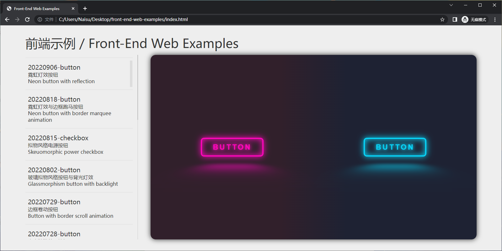
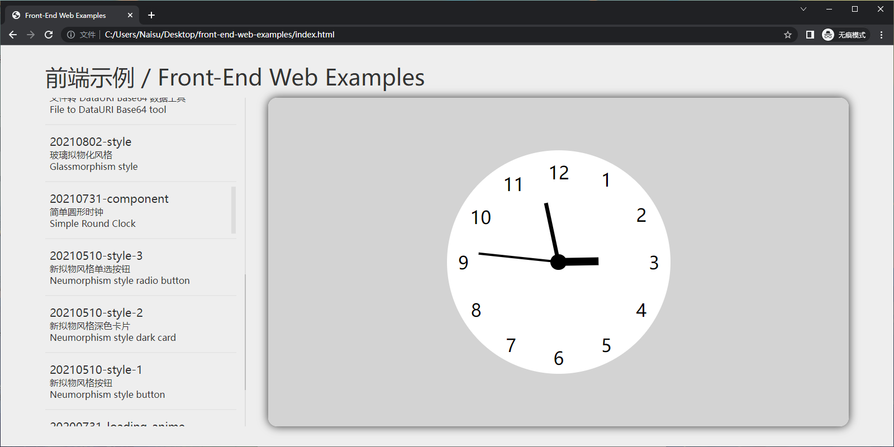

# 简介 / Brief 
该项目是我在工作和学习过程中涉及的前端相关的部分内容示例的集合。
This project is a collection of some content examples related to the front end involved in my work and study.

该页面可以展示位于<i>examples</i>目录下且在examples-list.js文件中有记录的示例。
This page can display examples that are located in the <i>examples</i> directory and recorded in the examples-list.js file.

# 使用方法 / Usage
双击打开根目录下<i>index.html</i>文件，在打开的页面中点击左边列表中项目即可显示示例。
Double click open the <i>index.html</i> file under the root directory, and click the list item on the left in the open page to display the example.

# 截图 / Screenshot

# 许可 / License
该项目基于MIT许可，具体内容详见LICENSE文件。
This project is under the MIT licence, see the LICENSE file.

